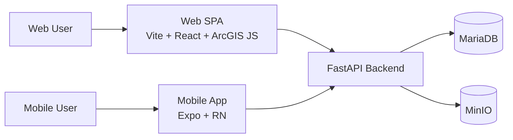
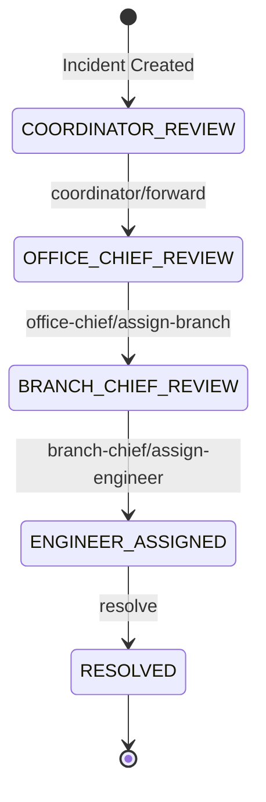
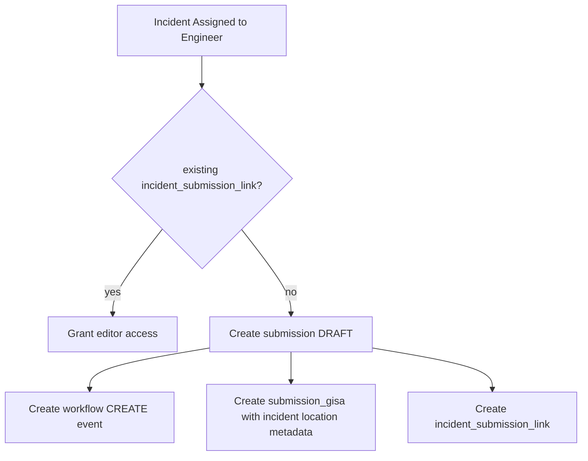
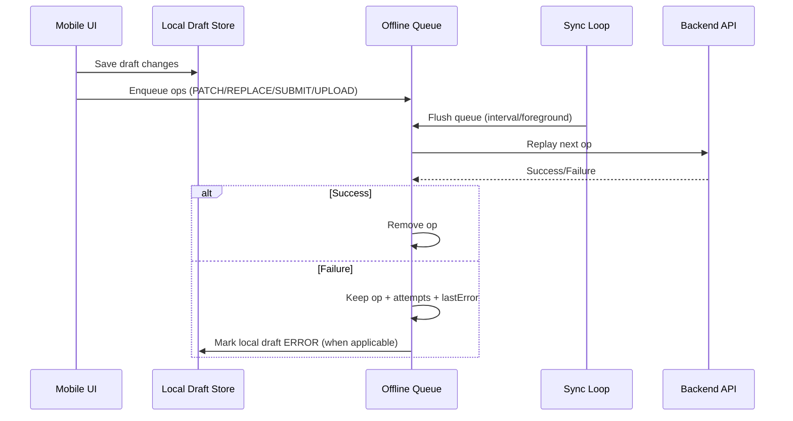
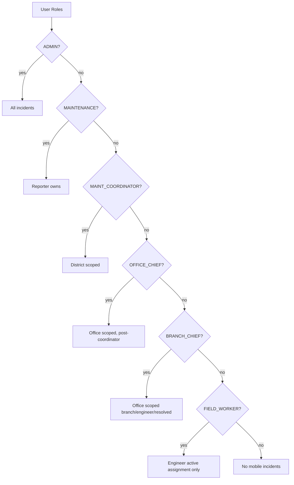

# Diagrams (Mermaid)

## 1) System Context

```mermaid
flowchart LR
  U1[Web User] --> WEB[Web SPA\nVite + React + ArcGIS JS]
  U2[Mobile User] --> MOB[Mobile App\nExpo + RN]
  WEB --> API[FastAPI Backend]
  MOB --> API
  API --> DB[(MariaDB)]
  API --> OBJ[(MinIO)]
```

## 2) Incident Workflow

```mermaid
stateDiagram-v2
  [*] --> COORDINATOR_REVIEW: Incident Created
  COORDINATOR_REVIEW --> OFFICE_CHIEF_REVIEW: coordinator/forward
  OFFICE_CHIEF_REVIEW --> BRANCH_CHIEF_REVIEW: office-chief/assign-branch
  BRANCH_CHIEF_REVIEW --> ENGINEER_ASSIGNED: branch-chief/assign-engineer
  ENGINEER_ASSIGNED --> RESOLVED: resolve
  RESOLVED --> [*]
```

## 3) Incident-to-Submission Link

```mermaid
flowchart TD
  A[Incident Assigned to Engineer] --> B{existing incident_submission_link?}
  B -- yes --> C[Grant editor access]
  B -- no --> D[Create submission DRAFT]
  D --> E[Create workflow CREATE event]
  D --> F[Create submission_gisa with incident location metadata]
  D --> G[Create incident_submission_link]
```

## 4) Mobile Offline Sync Sequence

```mermaid
sequenceDiagram
  participant UI as Mobile UI
  participant LD as Local Draft Store
  participant Q as Offline Queue
  participant S as Sync Loop
  participant API as Backend API

  UI->>LD: Save draft changes
  UI->>Q: Enqueue ops (PATCH/REPLACE/SUBMIT/UPLOAD)
  S->>Q: Flush queue (interval/foreground)
  Q->>API: Replay next op
  API-->>Q: Success/Failure
  alt Success
    Q->>Q: Remove op
  else Failure
    Q->>Q: Keep op + attempts + lastError
    Q->>LD: Mark local draft ERROR (when applicable)
  end
```

## 5) Role-Based Mobile Visibility

```mermaid
flowchart TD
  R[User Roles] --> A{ADMIN?}
  A -- yes --> ALL[All incidents]
  A -- no --> B{MAINTENANCE?}
  B -- yes --> OWN[Reporter owns]
  B -- no --> C{MAINT_COORDINATOR?}
  C -- yes --> DIST[District scoped]
  C -- no --> D{OFFICE_CHIEF?}
  D -- yes --> OFF[Office scoped, post-coordinator]
  D -- no --> E{BRANCH_CHIEF?}
  E -- yes --> BR[Office scoped branch/engineer/resolved]
  E -- no --> F{FIELD_WORKER?}
  F -- yes --> ENG[Engineer active assignment only]
  F -- no --> NONE[No mobile incidents]
```
